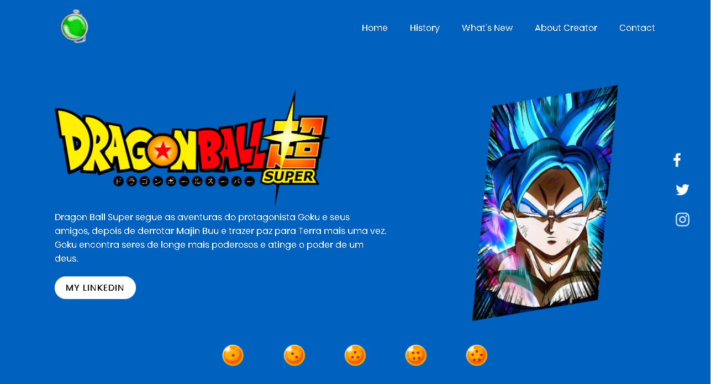
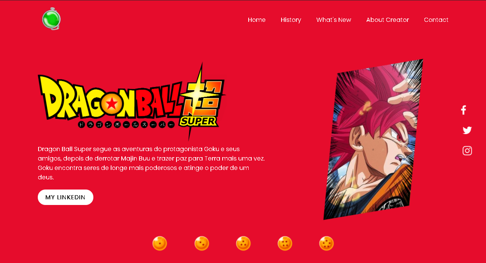
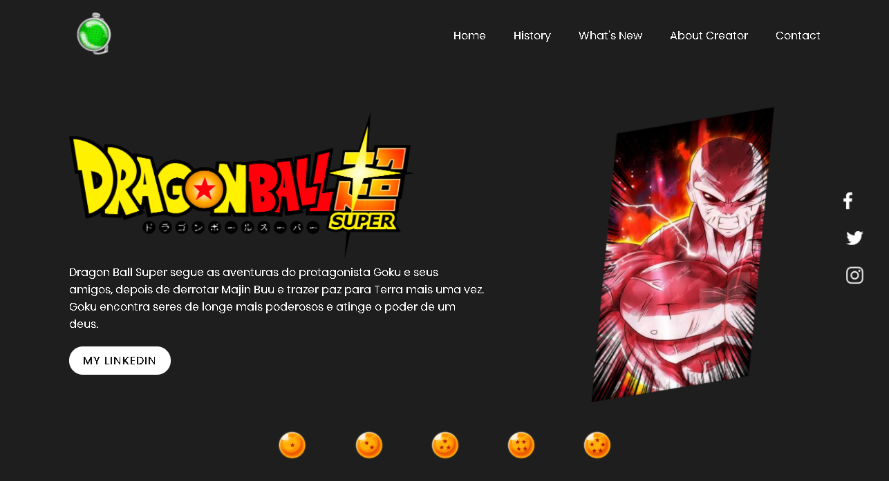
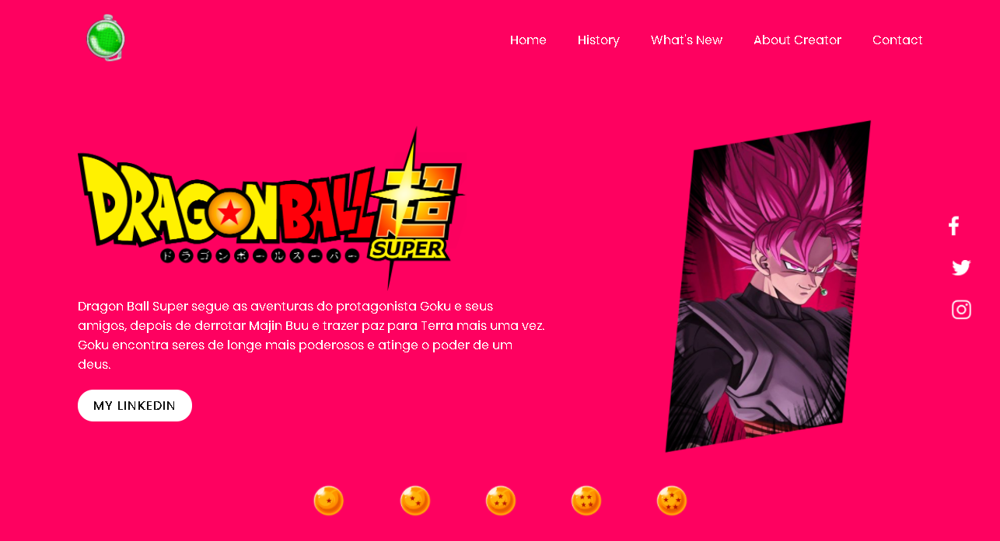
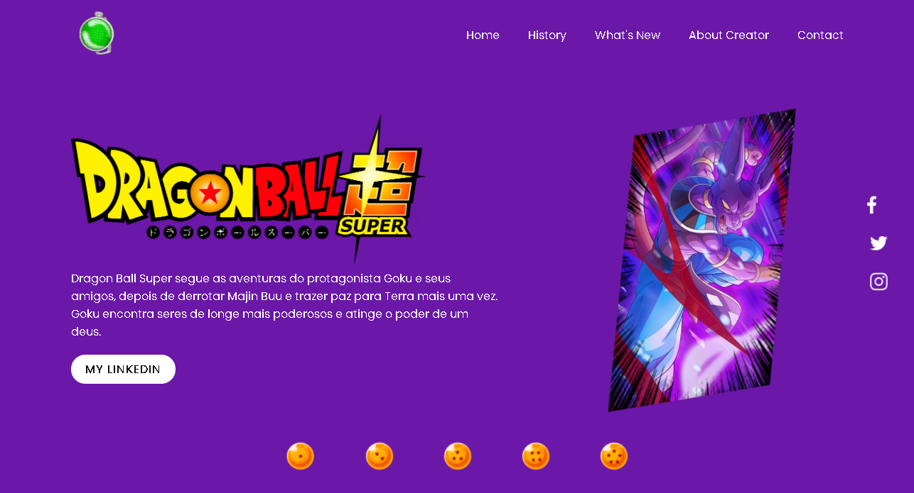
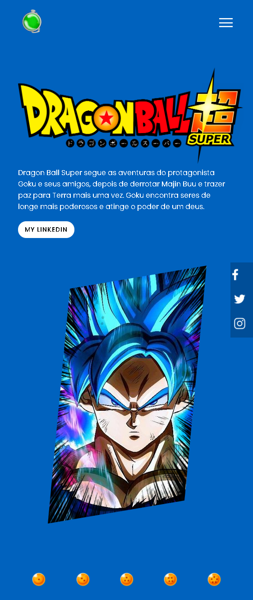
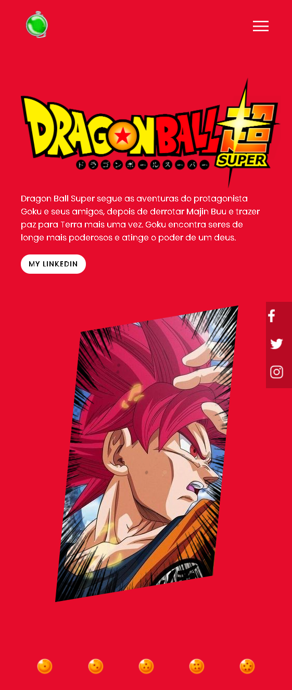
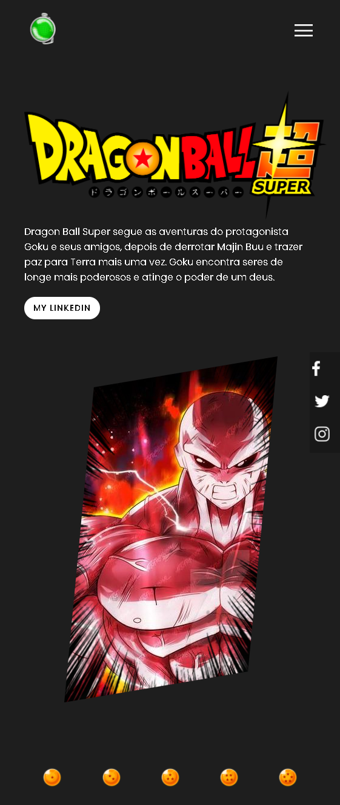
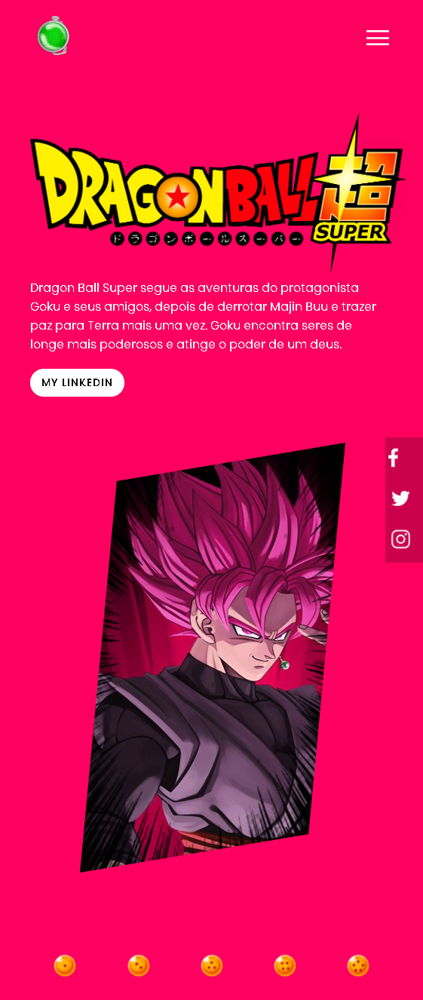
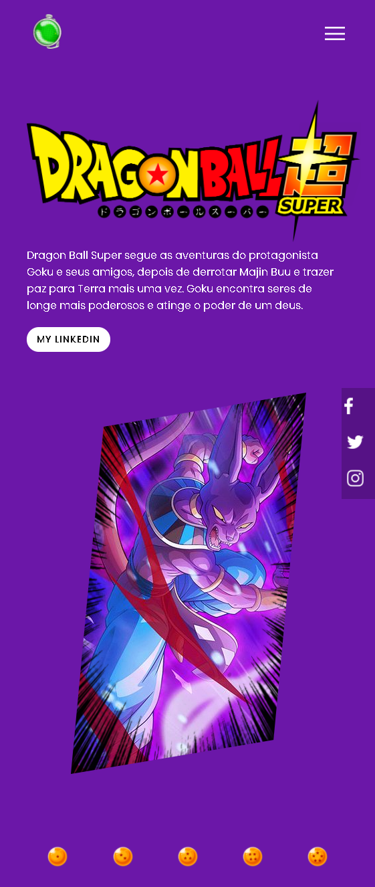

<h2> <b>Dragon ball super landing page. - Responsive. </b> </h2> 
  

 <b>Application Content:</b>  
  
• Changing color system.  
    ↳ Click on each of the dragon spheres and the color of the page will change according to the character's characteristics.  

 
<h3><em>• First dragon sphere // Primeira esfera do dragão. </h3> 
  
 ↳ Blue page - Goku god blue. 
  
 </img> 
 
<h3><em>• Second dragon sphere // Segunda esfera do dragão. </h3> 
  
 ↳ Red page - Goku god red. 
  
 </img> 
 
<h3><em>• Third dragon sphere // Terceira esfera do dragão. </h3> 
  
 ↳ Black page - Jiren. 
  
 </img> 
 
<h3><em>• Fourth dragon sphere // Quarta esfera do dragão. </h3> 
  
 ↳ Pink page - Goku Black, Super saiyan rose. 
  
 </img> 
 
<h3><em>• Fifth dragon sphere // Quinta esfera do dragão. </h3> 
  
 ↳ Purple page - Bills. 
  
 </img> 
  
<h3> Following are the site prints in responsive mode. </h3> 
  
 </img> 
 </img> 
 </img> 
 </img> 
 </img> 

<h3><b> <em>🗃️ About project: </em> </b> </h3>

 • Havia visto como criar landing pages no youtube, foi então que vi um vídeo em um canal gringo ensinando a fazer isto com latas de pepsi,
foi então que refiz todas as imagens e montei uma landing page com opções mais de núcleos e usando do tema de Dragon Ball Super. 
  

 • Havia visto como criar landing pages no youtube, foi então que vi um vídeo em um canal gringo ensinando a fazer isto com latas de pepsi, 
foi então que refiz todas as imagens e montei uma landing page com mais opções de cores e usando do tema de dragon ball super.

  

<em><b>Languages:</b></em> 

 

<em><b>I.D.E:</b></em> 

 

<h1><b>Hello, my name is Thiago Hercules 👋</b><i class="fas fa-code"></i></h1>

<em>Jr. fullstack developer. | Freelancer Designer. </em>

<h3><em><b>🌍About me:🧠</b></em></h3> 

Hello, my name is Thiago, I'm 18 years old and I'm a student in the 3rd period of Computer Science at UNIFG. I have knowledge in Java, acquired at Fuctura Tecnologia, also developing skills in the following areas: Oracle, MySQL, HTML, Java Web and CSS. Upon entering college I learned C / C ++, Python, IONIC and Pentest. As I studied at a reference school, I was introduced to robotics, where I participated in the Brazilian Robotics Olympiad (OBR) in 2018 and the official LEGO FLL (First Lego League) tournament in the Hydro Dinamics version in 2017. Through some personal projects I developed a portfolio for my design page, and I'm currently creating a Java API for managing a clinic. Just as I was part of a voluntary project called Jovens Pelas Ruas (JPR) during the period of 3 months.

  

 

<h3><em><b>📈 Projects: 📊</b></em></h3> 

#### - [Portfolio 📲](https://github.com/Thercules/PortfolioTdesigner) 

 

 ↳ This portfolio was created in order to promote my page as a freelance designer. On this site, contents such as projects and even super elaborated arts were attractively designated for user access. 

#### - [Project icarus](https://github.com/Thercules/Project-Icarus)

 

 ↳ The icarus project is a personal achievement. Since I was little I always wanted to write great comic books, just like the ones we see in the drawings, so, I present to you the icarus project, with deploying the html on a hosting site. 

<h3><em><b> 🔹 Languages of i know: 🎓</b></em></h3> 

 

 

 

 --> Projects in format MVC, DAO and CRUD.

<h3><em><b> 🔹 Languages of i need to improve myself: 😬</b></em></h3>

 

<h3><em><b> 🔹 I am interested in: 🧐</em><b></h3> 

	
<h3><em><b> 🔶 About BootCamps: 🚀</em><b></h3> 

 --> Bootcamp developer mobile | IGTI | 4/5 ✅ 

